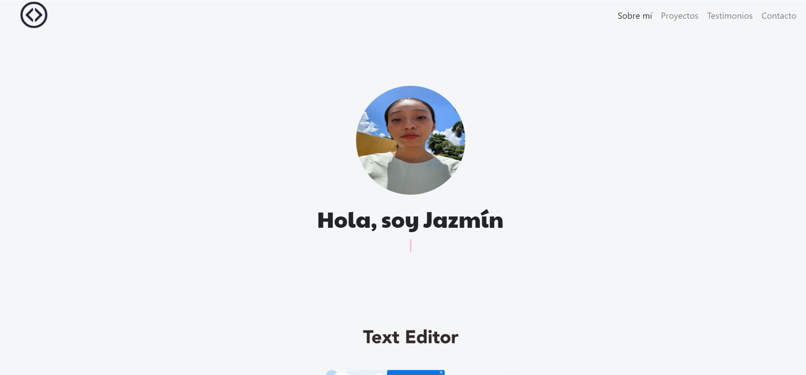
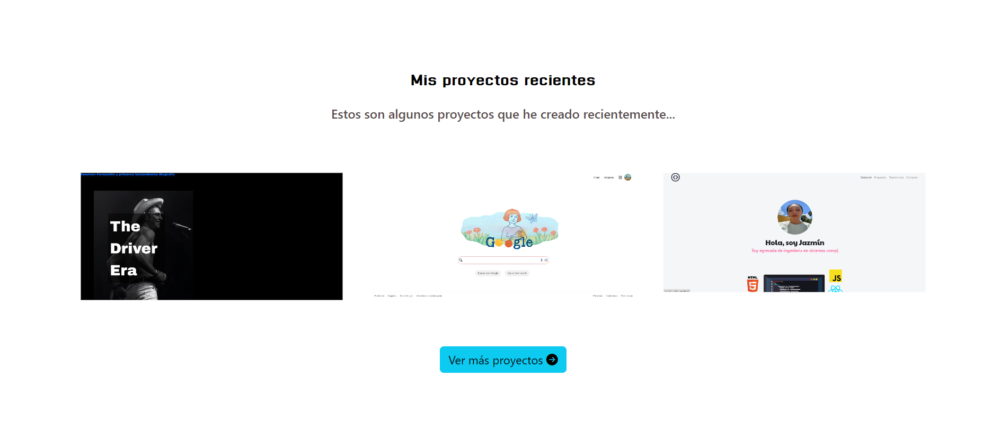
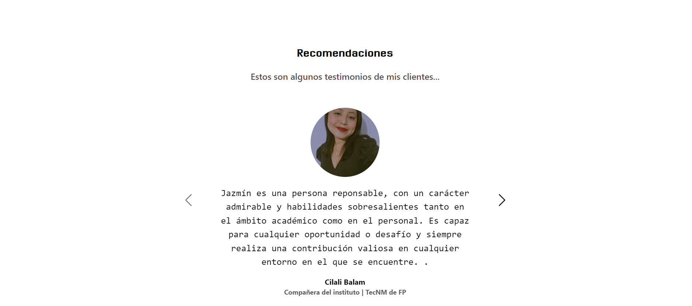
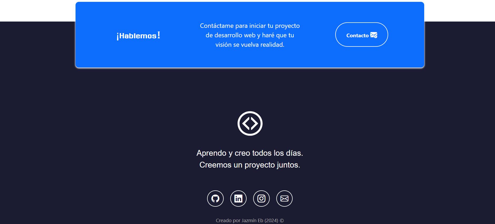

# Portafolio Adaptable (Responsive) con Bootstrap 5

Proyecto creado para el bootcamp Tecnolochicas PRO, es una página web adaptable a dispositivos de distintos tamaños (este tipo de sitio web se conoce en inglés como "responsive"). 
También incluye imágenes alternativas en la carpeta `imagenes` en caso de que se desee personalizar la imagen principal del desarrollador, además de animación a la escritura de la página web con JavaScript.
****

### Capturas de pantalla:💻

*Primera parte de la página web:*

*Experiencia:*

*Proyectos:*

*Testimonios:*

*Contacto:*

## Demo
Puedes entrar a ver el demo en este vínculo: 

https://dazzling-nightingale-01ce86.netlify.app

## Tecnologías

Esta página web fue creada con:

* HTML
* CSS
* JavaScript 
* Bootstrap 5

Se hizo uso de **Google Fonts** para personalizar la fuente y **Bootstrap icons** para incorporar íconos como flechas y logos de redes sociales populares. 

## Español

El texto de la página web está escrito en español, al igual que las clases y atributos personalizados. Las clases relacionadas con Bootstrap se incluyeron en inglés.

**Hecho por:**
Jazmín Gutiérrez ❤

